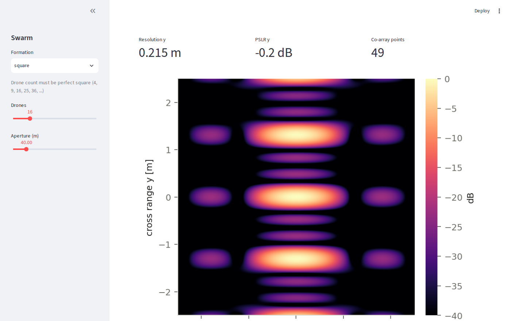

# UAV Formation RF Sensing Simulator

An interactive simulator for distributed UAV radar imaging. Sixteen drones fly in
formation over a border area, each carrying its own antenna array. Combine their
signals correctly and the swarm behaves like one very large radar.

The simulator lets you change the formation shape, the number of drones, the array
on each drone, and how many snapshots to fuse — and see immediately what happens to
the image.

## Quick start

```bash
pip install -r requirements.txt

pytest -m given -q                  # 36 tests pass: the physics works
python scripts/demo_physics.py      # see what the library does
python check_progress.py            # what is left to build

streamlit run simulator/app.py      # the app (once you have built Week 4)
```

Then open **`TASKS.md`** and start at Week 2.

By the end of Week 4 you should have this — three sliders and a live PSF:



## What you are building

The radar physics is **already written and tested**. You build everything between
it and the user:

```
    app.py          Streamlit GUI — the main deliverable
       |
       +--> state.py     SimConfig: the whole app state as one frozen value
       +--> engine.py    SimConfig -> Result, with caching
       +--> plotting.py  Result -> figures
       +--> presets.py   save / load configurations
       +--> export.py    CSV, PNG, report bundles
       +--> compare.py   A/B comparison
             |
             +--> uavsense/    the physics. GIVEN. Never edit.
```

**The one rule: `app.py` never imports `uavsense`.** It builds a `SimConfig` and
hands it to the engine. Everything below the GUI then stays testable without a
browser, which is why the test suite can check your work at all.

## What the simulator will let people explore

**Two levels of array.** The swarm (drones tens of metres apart) sets resolution
and creates grating lobes. The URA on each drone (elements centimetres apart) sets
gain and field of view. They multiply, and they do completely different jobs — a
distinction users reliably get wrong until a simulator shows them.

**Periodicity makes ghosts.** A 4×4 square grid produces a false target at
λR/d = 1.31 m, as bright as the real one. A ring with the same 16 drones does not.
The fix is aperiodicity, not shape as such.

**Diversity beats repetition.** Fly the same formation twice and you gain
signal-to-noise but *zero* new geometry — co-array gain exactly 1.00. Fly two
different ones and it jumps to 2.71.

**PSLR lies about position error.** The image is normalised by its own peak, so
sidelobe ratio barely moves even when the drones are scrambled by ten wavelengths.
Coherent gain collapses. Half of it is gone by **3 mm** of error — which rules out
GPS and demands radio ranging between drones.

## Tests

```bash
pytest -m given          # the physics — passes on day one
pytest -m week02         # SimConfig
pytest -m week03         # the engine
pytest -m week09         # presets
pytest -m week11         # export
pytest -q                # everything
```

The GUI weeks (4, 5, 6, 8, 10, 12) have no test file — you check those by using
the app.

## Layout

```
uavsense/       the physics library      [GIVEN — complete, 36 tests, do not edit]
  config.py       Scenario and URA parameter objects
  formations.py   formation generators + transforms
  ura.py          per-drone uniform rectangular array
  coarray.py      MIMO sum co-array and its metrics
  imaging.py      point spread function, metrics, coherent gain
  errors.py       position / phase error, dropped drones
  sequences.py    multi-snapshot strategies
  costs.py        reconfiguration time, coherence loss

simulator/      the application         [YOU BUILD THIS]
scripts/        demo_physics.py — run this first
tests/          the specification
presets/        saved configurations
```

## Milestones

| Week | Deliverable |
|---|---|
| 3 | Engine with working cache |
| 4 | **Three sliders and a live PSF** — the milestone |
| 6 | URA controls; the 3 mm positioning finding visible in the app |
| 8 | **Snapshot builder** — co-array gain 1.00 vs 2.71 on screen |
| 11 | Parameter sweeps with CSV export |
| 13 | Report, documented code, screen recording |
