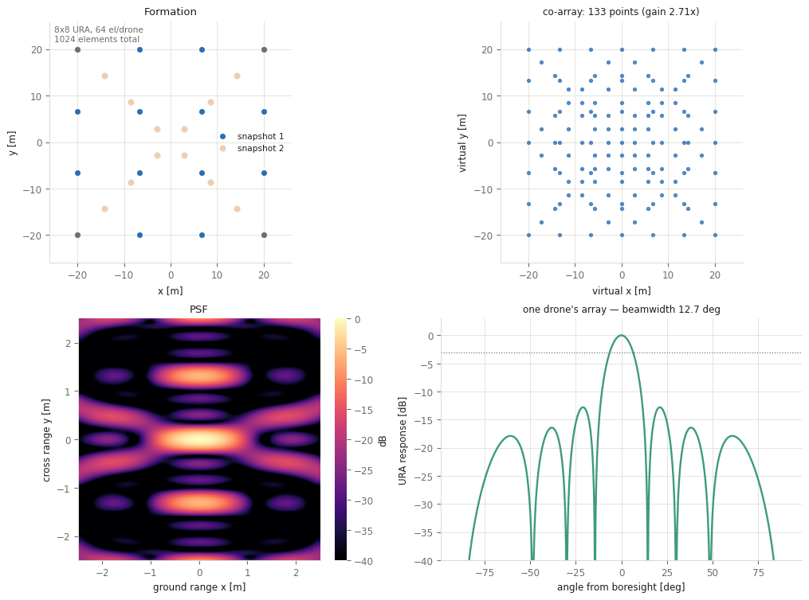

# Task list — building the simulator

You are building an **interactive simulator with a GUI**. The radar physics is
already written, tested, and off-limits. Your job is everything between the
physics and the user.

```bash
python check_progress.py --list   # every task, with file and line
pytest -m given -q                # 36 tests: proves the physics works
pytest -m week02 -v               # your current week
```

Every task is tagged `TODO(Wnn-n)` in the source.

---

## The architecture, and why it is this way

```
    app.py          Streamlit GUI — widgets in, figures out
       |
       +--> state.py     SimConfig: the whole app state as one frozen value
       |
       +--> engine.py    SimConfig -> Result. Caching lives here.
       |       |
       |       +--> uavsense/     the physics. GIVEN. Never edit.
       |
       +--> plotting.py  Result -> matplotlib figures
       +--> presets.py   save / load configurations
       +--> export.py    CSV, PNG, report bundles
       +--> compare.py   A/B comparison
```

**The one rule: `app.py` never imports `uavsense`.** It builds a `SimConfig` and
hands it to the engine.

This is not architectural fussiness. Streamlit re-runs your entire script on every
widget interaction — every keystroke, every slider pixel. If the GUI calls physics
directly there is no cache key, no way to save a configuration, no way to compare
two, and no way to test anything without launching a browser. Keep the boundary and
all four problems never appear.

---

## Week 1 — Get oriented

No code. See what you are putting a face on.

- [ ] `pip install -r requirements.txt`
- [ ] `pytest -m given -q` — **36 tests pass.** The physics works; any bug you hit
      later is in your layer, which halves your debugging surface.
- [ ] `python scripts/demo_physics.py` — prints the four key results and writes
      four figures. Read the output properly; it is the whole project in one page.
- [ ] `python -m uavsense.config` — the scenario summary
- [ ] Open `uavsense/imaging.py` and read `point_spread_function`. You never edit
      it, but you should know what your engine is calling.
- [ ] `git init` and commit the scaffold.
- [ ] Skim the Streamlit docs, especially `st.session_state` and caching.

**What to take away from the demo:** shape barely changes resolution but hugely
changes ghosts; the URA buys gain, not resolution; repeating a formation buys
nothing; and PSLR is nearly blind to position error while coherent gain collapses.
Those four facts are what your GUI has to make visible.

---

## Week 2 — `SimConfig`

**Goal: one frozen, hashable, serialisable object that IS the configuration.**

| Tag | Task |
|---|---|
| `W02-1` | `to_scenario()` — the bridge to the physics library |
| `W02-2` | `validate()` — return a list of readable problems |
| `W02-3a/b` | `to_dict()` / `from_dict()` — JSON round-trip, version-tolerant |

**Verify:** `pytest -m week02 -v`

Two things the tests are strict about, both for reasons you will feel later:

- **`from_dict` must ignore unknown keys.** You will add fields in week 8. A preset
  saved in week 5 must still load in week 12, not crash.
- **Error messages are for a user.** "Square formation needs a perfect square
  number of drones — 16 or 25, not 20" beats "invalid n_uav".

---

## Week 3 — The engine

**Goal: `run(config) -> Result`, fast enough to feel instant.**

| Tag | Task |
|---|---|
| `W03-1` | `SimConfig.cache_key()` — hashable, and **excludes `label`** |
| `W03-2` | `build_snapshots()` — sequence + errors |
| `W03-3` | `run()` — the function the GUI calls |
| `W03-4a/b` | `clear_cache()`, `cache_stats()` |
| `W03-5` | `estimate_cost()` — predict runtime without running |

**Verify:** `pytest -m week03 -v`

**Why the cache is not optional.** Streamlit re-runs everything on every
interaction. A full run at the default grid takes a few hundred milliseconds, so
without a cache, typing a six-character label costs several seconds of solid
compute and the app feels broken. With one, only a change that actually affects
the physics costs anything — which is exactly why `label` is excluded from the
key.

**The units trap the tests check for:** `sigma_pos_lambda` is in wavelengths,
`uavsense` wants metres. Forget the conversion and you are out by a factor of 30,
errors look harmless, and it reads as a physics mystery rather than the units bug
it is.

**A real inefficiency to notice:** `point_spread_function` and `measure` each
compute the PSF. The naive `run()` does the expensive work twice. Decide
deliberately what to do about it and leave a comment either way.

---

## Week 4 — First working GUI ⭐

**The milestone. Smallest thing that runs end to end.**

| Tag | Task |
|---|---|
| `W04-1` | `setup_page()` |
| `W04-2` | `sidebar_swarm()` — formation, drone count, aperture |
| `W04-3` | `build_config()` |
| `W04-4` | `main()` |

```bash
streamlit run simulator/app.py
```

Target: **three sliders on the left, a PSF that changes when you move them.**
Nothing else. No tabs, no presets.


That screenshot is a real run of this scaffold — sidebar, a metrics row, and the
4×4 square's ghost at ±1.31 m, exactly where λR/d says it should be. About 30
lines of `app.py`. If yours looks roughly like that, week 4 is done.

There is no test file for the GUI weeks — you check them by using the app. The
check for this week: move the drone-count slider from 16 to 25 and watch the
picture change.

**Make invalid combinations impossible.** Square needs a perfect square count, X
needs an even one. Use `valid_count()` and `nearest_valid_count()` to snap the
slider, and `st.caption` the constraint. A user who picks 20 drones and gets a
traceback is looking at a script with widgets; one whose slider politely jumps to
16 is using an application.

**Commit the moment this works.** From here everything is addition.

---

## Week 5 — All the panels

| Tag | Task |
|---|---|
| `W05-1` | `plot_formation` |
| `W05-2` | `plot_coarray` |
| `W05-3` | `plot_psf_image` |
| `W05-4` | `plot_psf_cuts` |
| `W05-5` | `show_metrics_row` |
| `W05-6` | `show_main_tabs` |
| `W05-7` | `show_status_bar` |



Two decisions that make the difference between a demo and an instrument:

- **Fix the colour scale.** If the dB range rescales per configuration the user
  cannot compare two runs, which is the entire point of a simulator.
- **Build the status bar for yourself.** Compute time and cache hit rate. In week
  11 when the app feels slow, this tells you whether you are missing the cache or
  genuinely computing too much — completely different fixes.

---

## Week 6 — URA and errors

| Tag | Task |
|---|---|
| `W06-1` | `plot_ura_pattern` |
| `W06-2` | `sidebar_ura()` — elements, spacing, steering, live readout |
| `W06-3` | `sidebar_errors()` — position, phase, dropped drones |

**Set the right expectation.** Users will assume more elements per drone means
better resolution. It does not — it means more gain and a narrower drone beam.
Resolution is the swarm's job. One `st.caption` saying so saves a lot of
confusion.

**The panel that teaches the most in the whole app:** put coherent gain next to
PSLR in the error section. Drag position error and watch gain fall 1.00 → 0.20
while PSLR barely moves. Half the gain is gone by **3 mm**. Plain GPS gives
metres — so this system needs radio ranging between drones, not GPS. That is a
real system-design conclusion your simulator produces on its own.

Warn when element spacing exceeds λ/2: the URA then grows its own grating lobes
(at ~42° for 1.5λ). Two levels of array, two independent ways to make a ghost.

---

## Week 7 — Consolidation

No new features. Docstrings, tidy-up, make sure it runs from a clean checkout on
a machine that is not yours. Write a 2-page summary. Decide with your supervisor
whether to trim scope.

**This is the designed cut point.** If you are behind, drop things here — not in
week 12.

---

## Week 8 — Snapshot builder ⭐

| Tag | Task |
|---|---|
| `W08-1` | `plot_snapshot_sequence` |
| `W08-2` | `sidebar_snapshots()` |

**Where the app starts making the project's argument.** Show co-array gain
prominently. Watching it sit at exactly **1.00** for "repeat" and jump to **2.71**
for "shapes" is the central finding, delivered by the app rather than by a
paragraph in a report.

In `plot_coarray`, colour points by which snapshot contributed them. That single
choice makes the second formation visibly fill the first one's gaps.

---

## Week 9 — Presets

| Tag | Task |
|---|---|
| `W09-1` | `BUILTIN` — the shipped library |
| `W09-2a–d` | `list_presets`, `save_preset`, `load_preset`, `delete_preset` |
| `W09-3` | `show_preset_controls()` |

**Verify:** `pytest -m week09 -v`

The built-in library doubles as documentation. Each entry is a worked example:
`square-ghost`, `ring-clean`, `repeat-is-useless`, `shift-helps`,
`shapes-help-more`, `big-ura`, `sparse-ura`, `gps-is-not-enough`,
`coherence-cost`. Build each, **look at it**, and only keep the description if it
matches what you actually see.

**The Streamlit gotcha that costs an hour:** you cannot set a widget's value after
it exists. Loading a preset means writing into `st.session_state` and calling
`st.rerun()`. Use `key=` on every widget.

---

## Week 10 — A/B comparison

| Tag | Task |
|---|---|
| `W10-1` | `plot_metric_bars` |
| `W10-2` | `plot_comparison` |
| `W10-3a–c` | `diff_configs`, `compare`, `ComparisonResult` |
| `W10-4` | `show_comparison_view()` |

Comparison means putting lines **on top of each other**, not side by side. Overlay
the two PSF cuts on one axis.

**Decide and document which direction is "better" for each metric.** Resolution:
lower. PSLR: lower. Coherent gain: **higher**. Get that table wrong and the app
will cheerfully report an improvement when things got worse.

---

## Week 11 — Sweeps and export

| Tag | Task |
|---|---|
| `W11-1` | `engine.sweep()` |
| `W11-2` | `plot_sweep` |
| `W11-3a–c` | `provenance`, `result_to_csv`, `results_to_csv` |
| `W11-4` | `figure_to_png_bytes` |
| `W11-5` | `export_bundle` |
| `W11-6` | `show_sweep_view()` |

**Verify:** `pytest -m week11 -v`

This is what turns a toy into an instrument: instead of dragging a slider and
squinting, the user gets a curve.

**Never run a sweep automatically on script re-run** — put it behind a button, or
the app launches a twenty-point sweep every time someone types a character.

For a resolution sweep, overlay the λR/2D prediction as a dashed line. Measurement
landing on theory is the most convincing plot the app can produce.

---

## Week 12 — Polish

| Tag | Task |
|---|---|
| `W12-1` | Morphing animation |
| `W12-2` | Performance pass |
| `W12-3` | Error handling and empty states |

Use `costs.assignment()` for the animation, or the drones cross over each other
and it looks like chaos rather than a manoeuvre.

Try the app on a colleague without explaining it. Watch where they hesitate. Fix
those places, not the ones you find interesting.

---

## Week 13 — Wrap-up

- [ ] `pytest -q` green from a clean checkout
- [ ] `python check_progress.py` reports zero
- [ ] App runs on a machine that is not yours
- [ ] README explains how to run it and what each panel means
- [ ] Report written
- [ ] Screen recording of the app in use

---

## Some Suggestions

**Commit when a test goes green.** Even ugly code.

**Use your own app weekly.** Not test it — *use* it, to answer a question you
actually have. That is how you find the missing control, and it is the only
reliable way.

**Watch the cache hit rate.** If it stays near zero while you drag a slider over
values you have already visited, something in your key is changing when it should
not.
